# Device Systems API v2.0

## FastAPI con SQLAlchemy: Persistencia de Datos y CRUD sobre Base de Datos

### Tecnologías Utilizadas

- Python
- FastAPI
- SQLAlchemy
- Alembic
- SQLite
- Swagger UI

---

# Introducción

En esta actividad se realizó la evolución del proyecto **device_systems**, incorporando persistencia de datos mediante SQLAlchemy y una base de datos relacional SQLite. Además, se implementaron migraciones con Alembic, relaciones entre entidades, consultas avanzadas mediante JOIN y validaciones de negocio para la gestión de usuarios, dispositivos y préstamos.

---

# Objetivos

- Implementar persistencia de datos utilizando SQLAlchemy.
- Gestionar migraciones mediante Alembic.
- Establecer relaciones entre tablas utilizando llaves foráneas.
- Implementar operaciones CRUD sobre usuarios, dispositivos y préstamos.
- Realizar consultas avanzadas utilizando JOIN.
- Aplicar filtros y validaciones de negocio.
- Documentar la API mediante Swagger UI.

---

# Instalación y Ejecución

## Clonar repositorio

```bash
git clone URL_DEL_REPOSITORIO
cd device_systems
```

## Crear entorno virtual

```bash
python -m venv .venv
```

## Activar entorno virtual

### Windows

```bash
.venv\Scripts\activate
```

### Git Bash

```bash
source .venv/Scripts/activate
```

## Instalar dependencias

```bash
pip install -r requirements.txt
```

## Ejecutar servidor

```bash
python -m uvicorn app.main:app --reload
```

## Acceder a Swagger

```text
http://127.0.0.1:8000/docs
```

---

# Estructura del Proyecto

```text
device_systems/
│
├── alembic/
├── app/
│   ├── database/
│   ├── dependencies/
│   ├── models/
│   ├── routes/
│   ├── schemas/
│   ├── services/
│   └── main.py
│
├── images/
├── requirements.txt
├── alembic.ini
└── README.md
```

---

# Evidencias de la Actividad

## Captura 1 - Inicialización de Alembic (alembic init)


---

## Captura 2 - Generación de Migración (alembic revision --autogenerate)


---

## Captura 3 - Aplicación de Migración (alembic upgrade head)


---

## Captura 4 - Estructura de Tablas Generadas


---

## Captura 5 - Swagger UI


---

## Captura 6 - Crear Usuario (POST /users)


---

## Captura 7 - Listar Usuarios (GET /users)


---

## Captura 8 - Crear Dispositivo (POST /devices)


---

## Captura 9 - Listar Dispositivos (GET /devices)

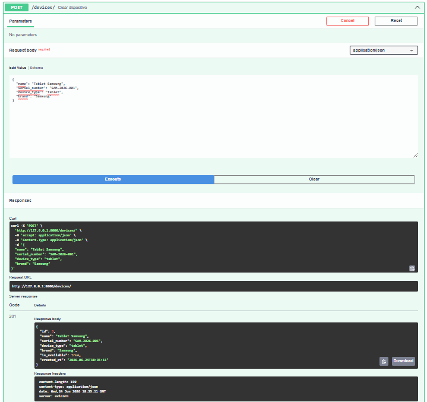

---

## Captura 10 - Crear Préstamo (POST /loans)

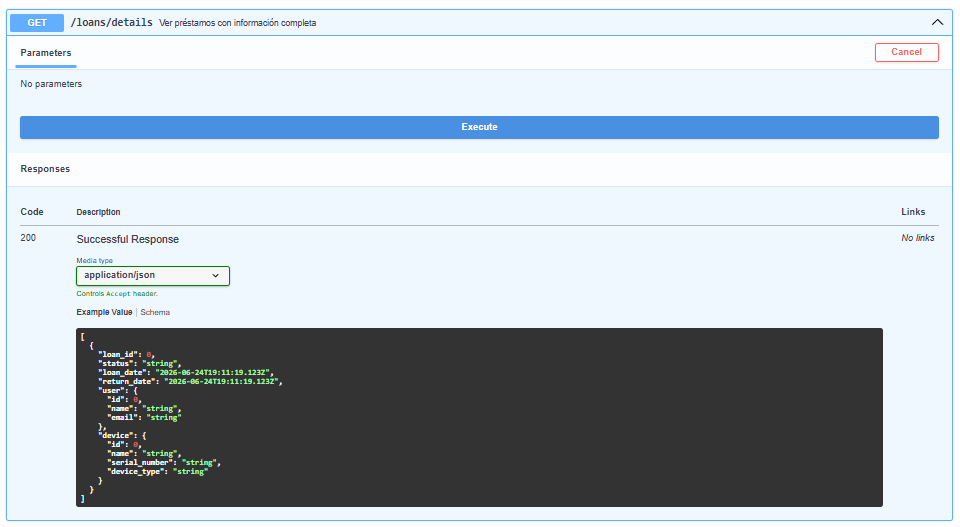

---

## Captura 11 - Listar Préstamos (GET /loans)

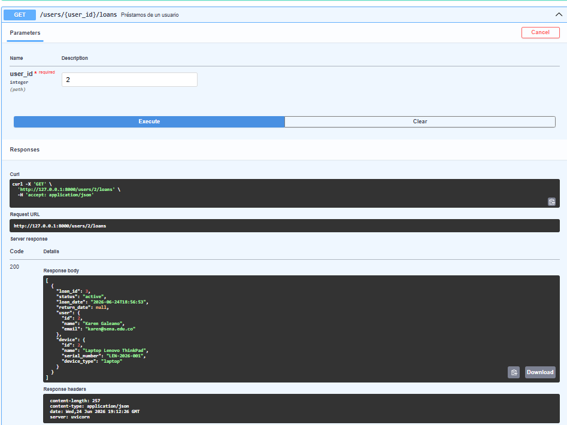

---

## Captura 12 - Consulta Completa con JOIN (GET /loans/details)

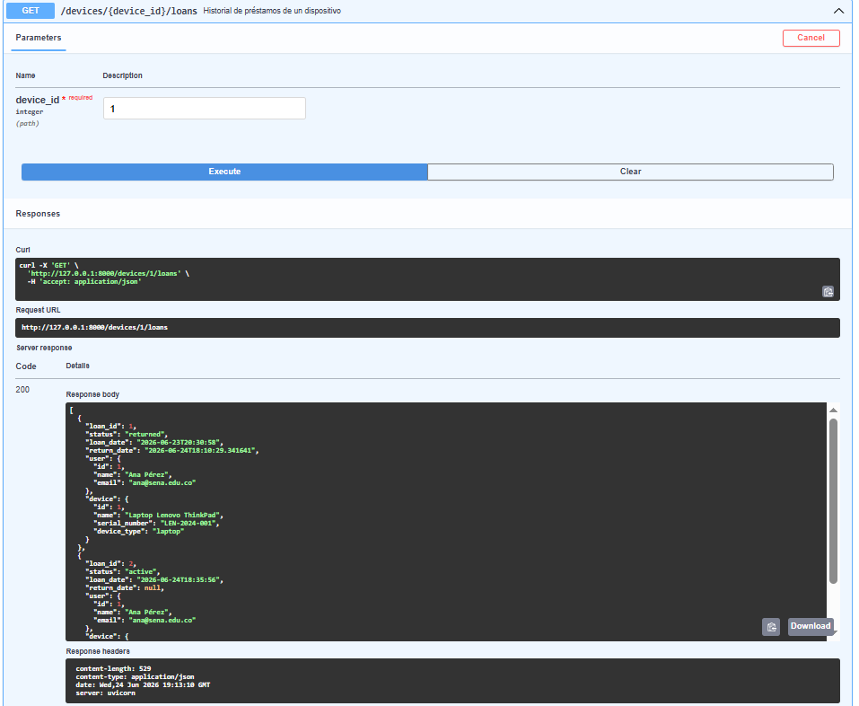

---

## Captura 13 - Préstamos de un Usuario (GET /users/{user_id}/loans)

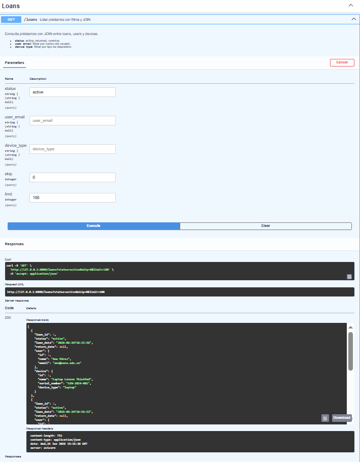

---

## Captura 14 - Historial de Préstamos de un Dispositivo (GET /devices/{device_id}/loans)

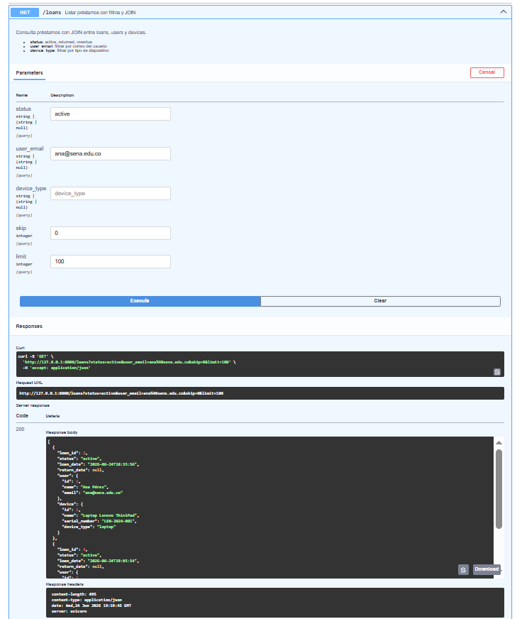

---

## Captura 15 - Filtro por Estado de Préstamo

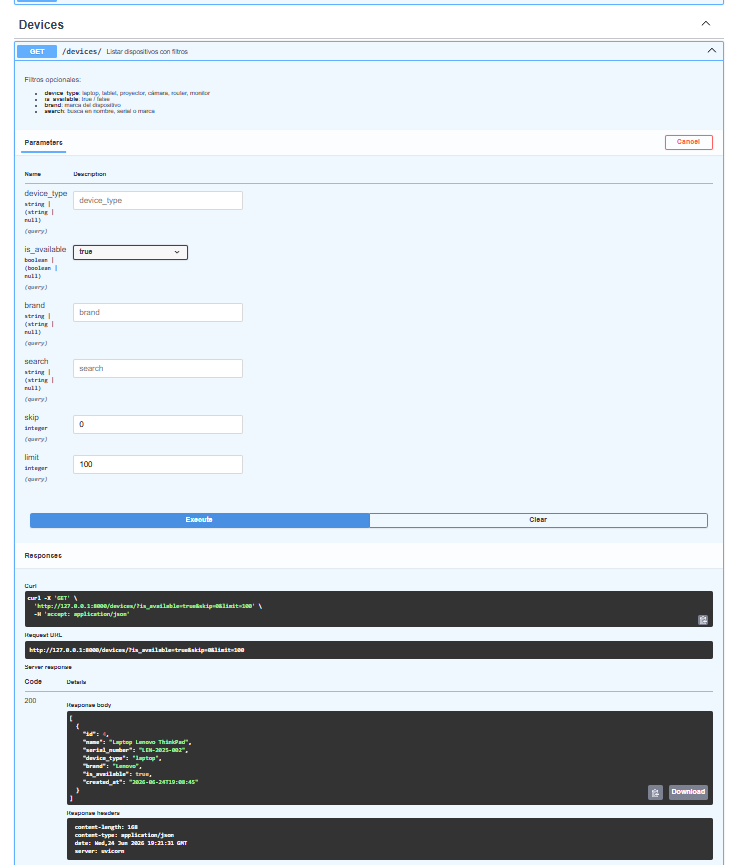

---

## Captura 16 - Filtro por Disponibilidad de Dispositivos

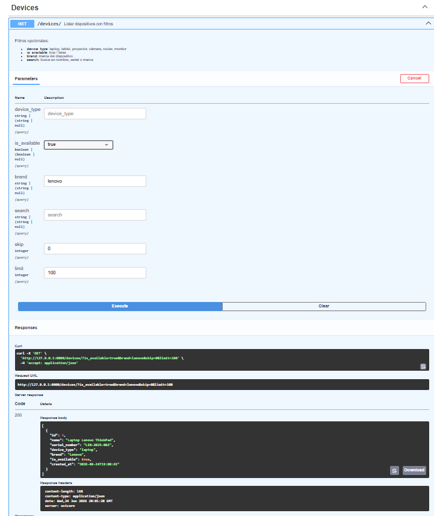

---

## Captura 17 - Filtro por Marca de Dispositivo

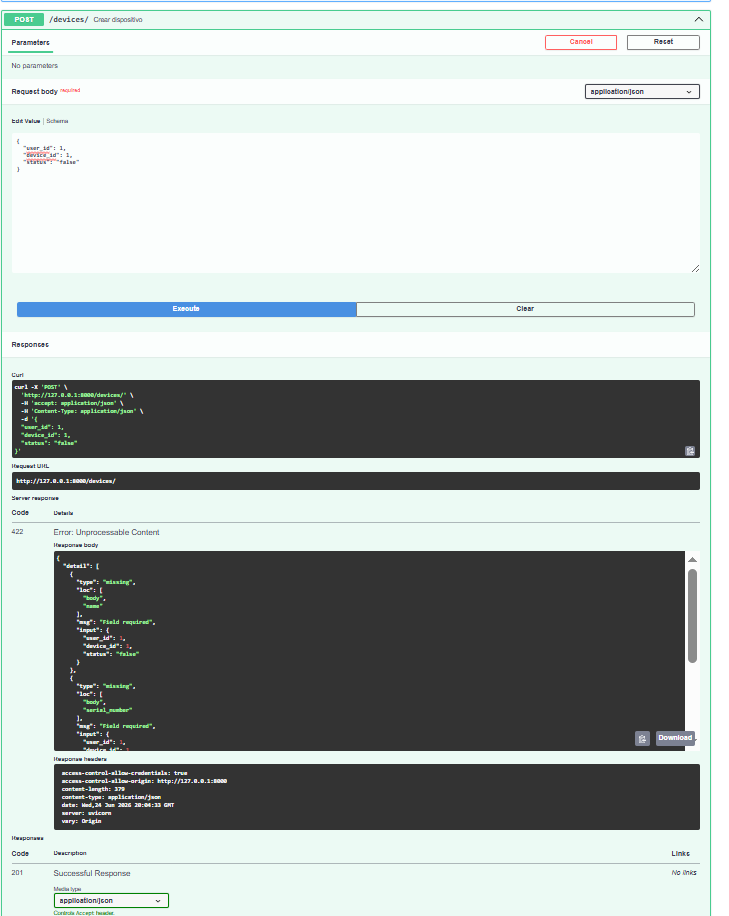

---

## Captura 18 - Validación de Dispositivo No Disponible

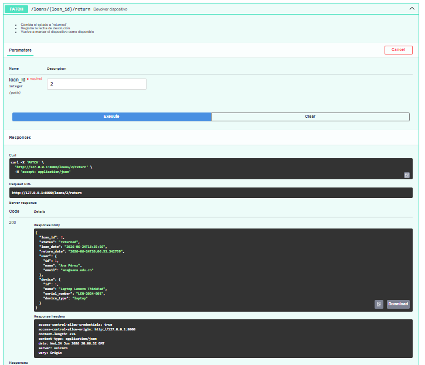

---

## Captura 19 - Devolución de Dispositivo (PATCH /loans/{loan_id}/return)

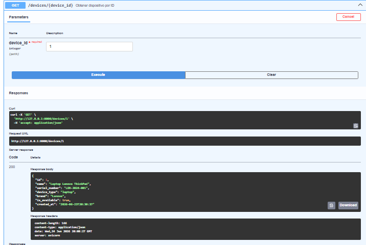

---

## Captura 20 - Verificación de Disponibilidad Después de la Devolución


---

## Captura 21 - Validación de Devolución Duplicada

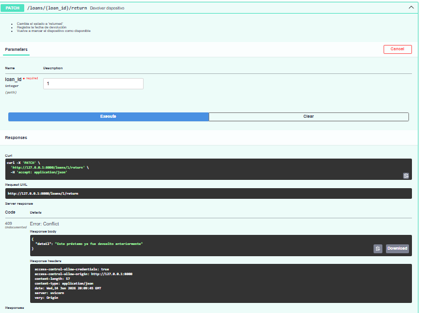

---

# Resultados Obtenidos

Durante el desarrollo de la actividad se logró:

- Implementar persistencia de datos mediante SQLAlchemy.
- Gestionar migraciones utilizando Alembic.
- Establecer relaciones entre usuarios, dispositivos y préstamos.
- Implementar consultas avanzadas utilizando JOIN.
- Aplicar filtros dinámicos sobre usuarios, dispositivos y préstamos.
- Implementar validaciones de negocio para garantizar la integridad de la información.
- Documentar completamente la API mediante Swagger UI.
- Gestionar correctamente la disponibilidad de dispositivos durante los préstamos y devoluciones.

---

# Reflexión

Durante el desarrollo de esta actividad comprendí la importancia de utilizar SQLAlchemy para gestionar la persistencia de datos y Alembic para controlar las migraciones de la base de datos. Las migraciones permiten mantener la estructura organizada y actualizada sin perder información, facilitando la evolución del proyecto a medida que se agregan nuevas funcionalidades.

También entendí cómo implementar relaciones entre tablas mediante llaves foráneas, permitiendo conectar usuarios, dispositivos y préstamos de manera eficiente. El uso de consultas con JOIN facilitó la obtención de información relacionada en una sola operación, mejorando el rendimiento y la organización de los datos.

Además, las validaciones implementadas garantizaron la integridad de la información, evitando préstamos sobre dispositivos no disponibles y controlando correctamente las devoluciones. Esto permitió comprender la importancia de las reglas de negocio dentro de una API profesional.

Finalmente, Swagger UI facilitó las pruebas, documentación y verificación de cada endpoint desarrollado, permitiendo validar rápidamente el comportamiento del sistema.

---

# Conclusiones

- FastAPI permite desarrollar APIs REST de forma rápida y organizada.
- SQLAlchemy facilita la persistencia de datos mediante el uso del patrón ORM.
- Alembic permite gestionar cambios en la estructura de la base de datos de manera segura.
- Las relaciones entre entidades mejoran la organización y consistencia de la información.
- Las consultas JOIN permiten obtener datos relacionados de forma eficiente.
- Las validaciones implementadas ayudan a mantener la integridad de los datos.
- Swagger UI es una herramienta fundamental para documentar y probar APIs.

