# device_systems crud completo

## Descripción

**device_systems** es una API REST desarrollada con FastAPI para la gestión de usuarios. El proyecto implementa operaciones CRUD completas sobre el recurso **users**, permitiendo crear, consultar, actualizar y eliminar usuarios.

Además, la aplicación incorpora validación de datos mediante Pydantic, manejo de errores con HTTPException, documentación automática con Swagger UI y ReDoc, y reutilización de lógica mediante Dependency Injection.

---

# Tecnologías utilizadas

- Python 3
- FastAPI
- Uvicorn
- Pydantic v2
- Git
- GitHub

---

# Instalación

Instalar las dependencias necesarias:

```bash
pip install fastapi
pip install uvicorn
pip install pydantic
pip install email-validator
```

O utilizando requirements.txt:

```bash
pip install -r requirements.txt
```

---

# Ejecución del proyecto

Ejecutar el servidor desde la raíz del proyecto:

```bash
python -m uvicorn app.main:app --reload
```

La API estará disponible en:

```text
http://127.0.0.1:8000
```
---

# Estructura del proyecto

```text
device_systems/
│
├── app/
│   ├── main.py
│   │
│   ├── routes/
│   │   └── user_routes.py
│   │
│   ├── schemas/
│   │   └── user_schema.py
│   │
│   ├── services/
│   │   └── user_service.py
│   │
│   ├── dependencies/
│   │   └── user_dependencies.py
│   │
│   └── data/
│       └── users_db.py
│
├── images/
│
├── requirements.txt
└── README.md
```

---

# Explicación de la estructura

### routes

Contiene los endpoints de la API.

### schemas

Contiene los modelos Pydantic utilizados para validar datos de entrada y salida.

### services

Contiene la lógica de negocio relacionada con los usuarios.

### dependencies

Contiene funciones reutilizables mediante Dependency Injection.

### data

Contiene la simulación de la base de datos en memoria.

---

# Endpoints disponibles

| Método | Endpoint | Descripción |
|----------|-------------|-------------|
| GET | /users | Listar usuarios |
| GET | /users/{user_id} | Consultar usuario por ID |
| POST | /users | Crear usuario |
| PUT | /users/{user_id} | Actualizar usuario completamente |
| PATCH | /users/{user_id} | Actualizar parcialmente un usuario |
| DELETE | /users/{user_id} | Eliminar usuario |

---

# Evidencia de pruebas de endpoints

## Captura 1 - GET /users


---

## Captura 2 - GET /users/{user_id}


---

## Captura 3 - POST /users


---

## Captura 4 - PUT /users/{user_id}


---

## Captura 5 - PATCH /users/{user_id}


---

## Captura 6 - DELETE /users/{user_id}


---

# Evidencia de errores controlados

## Captura 7 - Error 404 Not Found

Prueba realizada consultando un usuario inexistente.

**Respuesta obtenida:**

```json
{
  "detail": "Usuario no encontrado"
}
```


---

## Captura 8 - Error 400 Bad Request

Prueba realizada intentando registrar un correo electrónico duplicado.

**Respuesta obtenida:**

```json
{
  "detail": "El correo ya existe"
}
```


---

# Ejemplo de creación de usuario

```json
{
  "name": "Karen",
  "email": "karen@gmail.com",
  "role": "admin",
  "is_active": true
}
```

---

# Dependency Injection (Depends)

Se implementó Dependency Injection mediante la función:

```python
def get_user_or_404(user_id: int):
```

Esta dependencia permite validar la existencia de un usuario antes de realizar operaciones como actualización o eliminación.

### Beneficios

- Reutilización de código.
- Menor duplicación de lógica.
- Mejor organización del proyecto.
- Mayor mantenibilidad.

---

# Manejo de errores

La API controla diferentes situaciones mediante HTTPException:

- Usuario no encontrado.
- Correo electrónico duplicado.
- Actualización sin datos.
- Eliminación de usuario inexistente.
- Errores de validación de Pydantic.

Ejemplo:

```json
{
  "detail": "Usuario no encontrado"
}
```

---

# Códigos de estado HTTP utilizados

| Código | Descripción |
|----------|-------------|
| 200 | Operación exitosa |
| 201 | Recurso creado correctamente |
| 400 | Solicitud incorrecta |
| 404 | Usuario no encontrado |
| 422 | Error de validación |

---

# Reflexión final

Durante el desarrollo de esta actividad se evolucionó una API básica hacia una API REST más completa y profesional. Se implementaron operaciones CRUD completas utilizando los métodos GET, POST, PUT, PATCH y DELETE. También se incorporaron validaciones mediante Pydantic, manejo de errores con HTTPException y documentación automática mediante Swagger UI y ReDoc.

La utilización de Dependency Injection permitió reutilizar lógica común y mejorar la organización del proyecto. Esta evolución facilitó la comprensión de buenas prácticas para el desarrollo de APIs REST utilizando FastAPI.

---------------------------------------------------------------------------------


# Device Systems API - FastAPI con SQLAlchemy

## Descripción

Este proyecto corresponde a la evolución de la API REST **device_systems**, incorporando persistencia de datos mediante **SQLAlchemy** y una base de datos **SQLite**.

La API permite:

- Crear usuarios.
- Consultar usuarios.
- Consultar usuarios por ID.
- Filtrar usuarios por rol.
- Filtrar usuarios por estado.
- Actualizar usuarios.
- Eliminar usuarios.
- Validar datos mediante Pydantic.
- Gestionar errores controlados.
- Documentar la API mediante Swagger y ReDoc.

---

## Captura 1 - Estructura del Proyecto


---

## Captura 2 - Base de Datos SQLite


---

## Captura 3 - Swagger UI


---

## Captura 4 - Crear Usuario (POST /users)


---

## Captura 5 - Listar Usuarios (GET /users)


---

## Captura 6 - Consultar Usuario por ID (GET /users/{user_id})


---

## Captura 7 - Actualización Completa (PUT /users/{user_id})


---

## Captura 8 - Actualización Parcial (PATCH /users/{user_id})


---

## Captura 9 - Eliminación de Usuario (DELETE /users/{user_id})


---

## Captura 10 - Error Controlado


# Diferencia entre Modelo SQLAlchemy y Schema Pydantic

## Modelo SQLAlchemy

El modelo SQLAlchemy representa la estructura de la tabla en la base de datos.

Funciones principales:

- Crear tablas.
- Definir columnas.
- Establecer restricciones.
- Gestionar relaciones con la base de datos.
- Realizar operaciones CRUD.

Ejemplo:

```python
class User(Base):
    __tablename__ = "users"

    id = Column(Integer, primary_key=True)
    name = Column(String, nullable=False)
    email = Column(String, unique=True, nullable=False)
```

## Schema Pydantic

Los schemas Pydantic se utilizan para validar los datos que entran y salen de la API.

Funciones principales:

- Validar datos recibidos.
- Validar tipos de datos.
- Definir respuestas de la API.
- Generar documentación automática.

Ejemplo:

```python
class UserCreate(BaseModel):
    name: str
    email: EmailStr
    role: str
```

---

# Reflexión Final

La incorporación de persistencia mediante SQLAlchemy permitió que la aplicación dejara de depender de estructuras temporales en memoria y comenzara a almacenar información de forma permanente en una base de datos SQLite.

Durante el desarrollo se comprendió la diferencia entre los modelos SQLAlchemy y los schemas Pydantic, así como la importancia de aplicar validaciones, restricciones y manejo de errores en una API REST.

El uso de persistencia mejora la confiabilidad del sistema, facilita el mantenimiento de la información y acerca el proyecto a escenarios reales de desarrollo backend, donde los datos deben conservarse incluso después de reiniciar la aplicación.

---------------------------------------------------------------------------------------------------------------------------------------------------------------------------


# Device Systems Proyecto final

## Captura de la estructura del proyecto

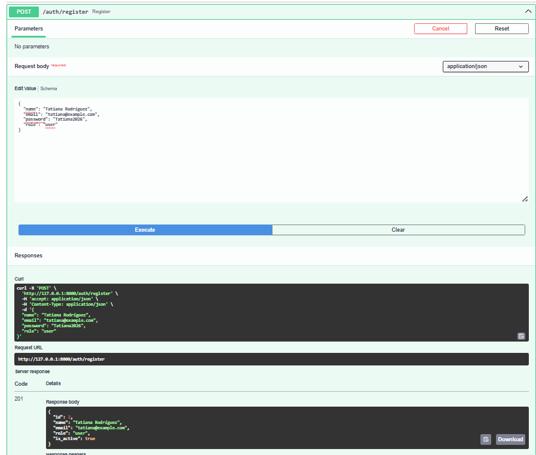

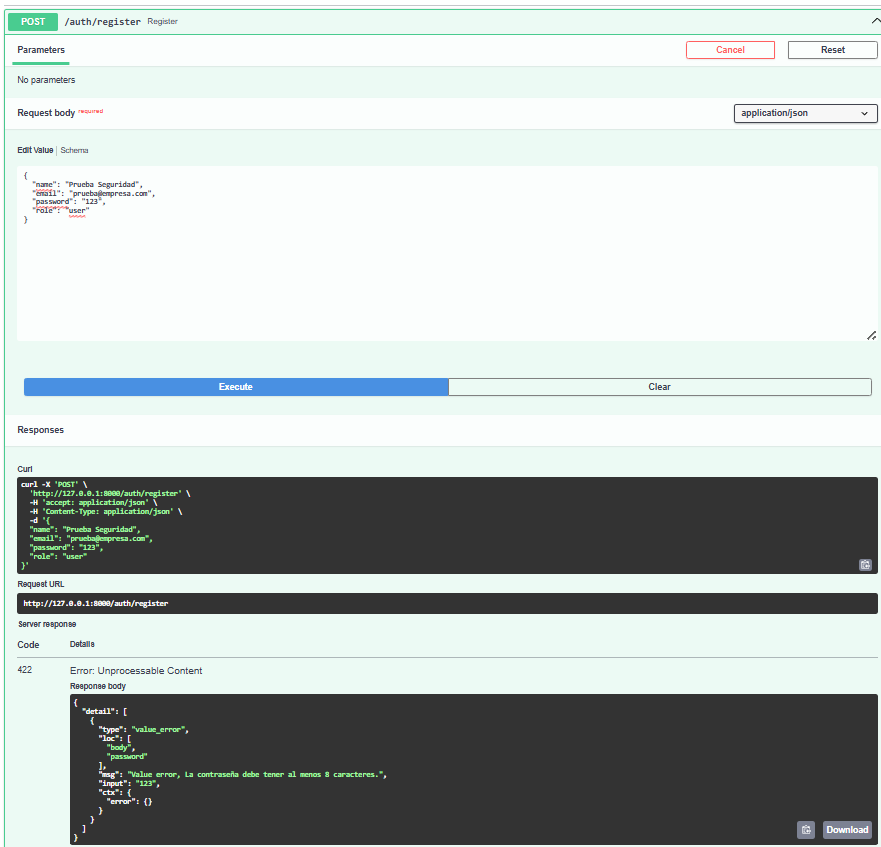

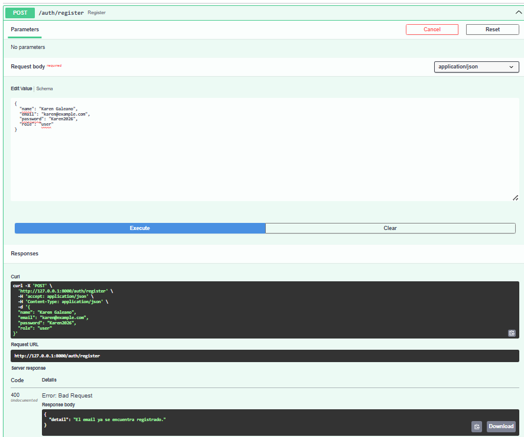

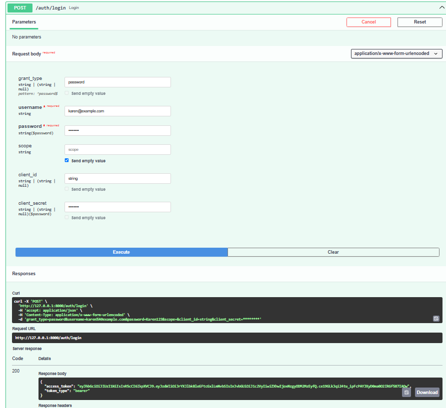

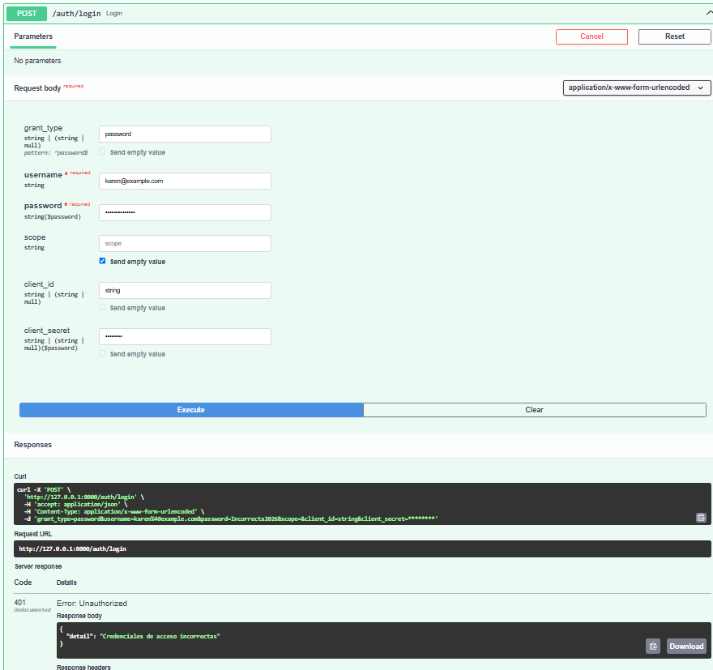

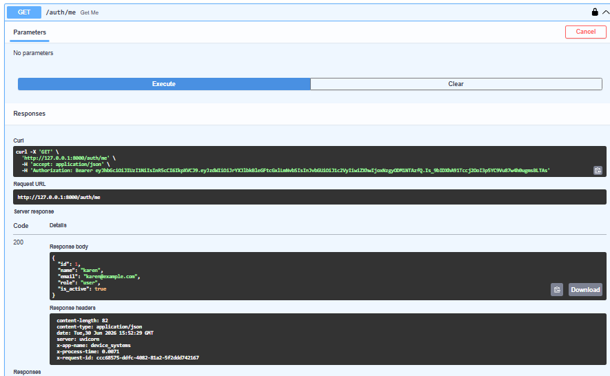

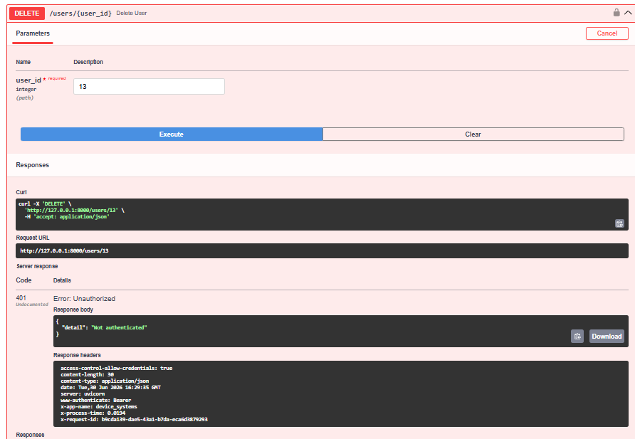

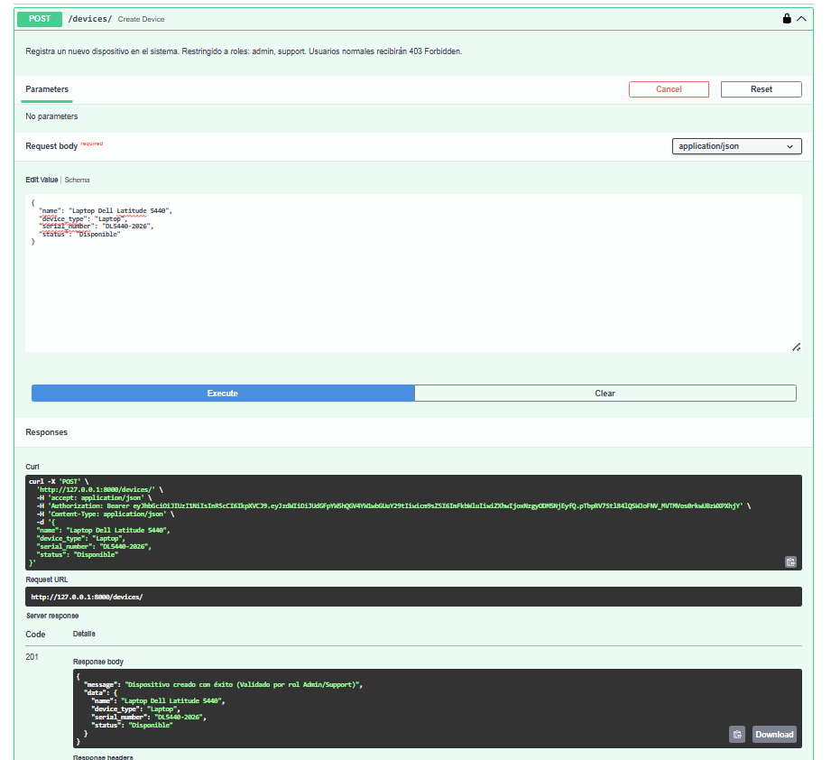

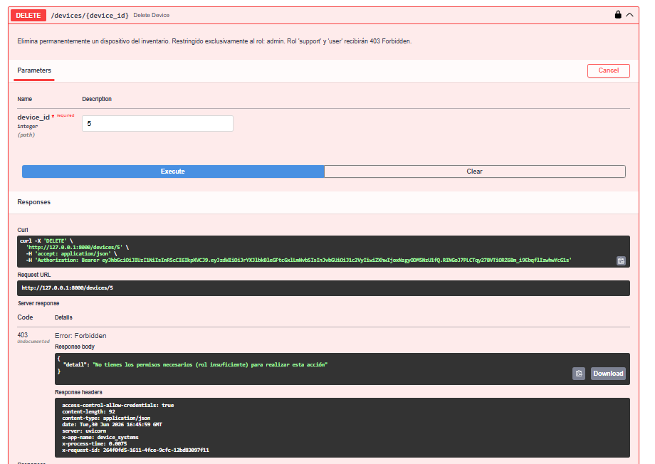

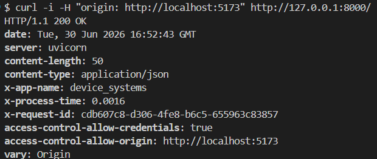


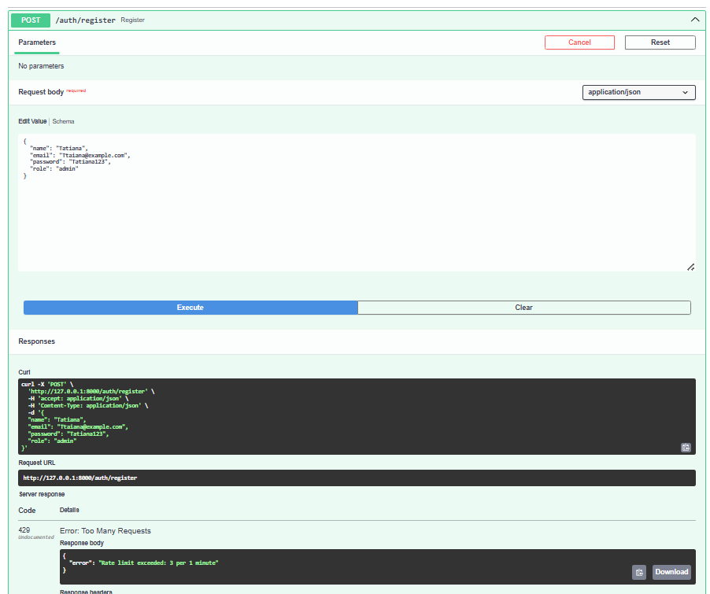

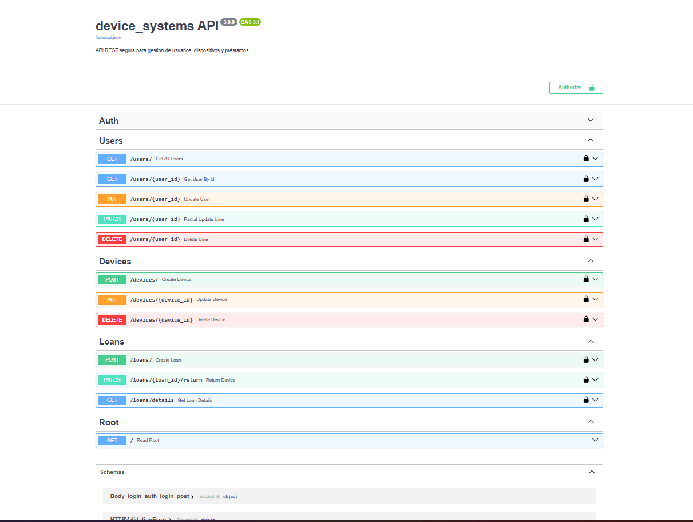

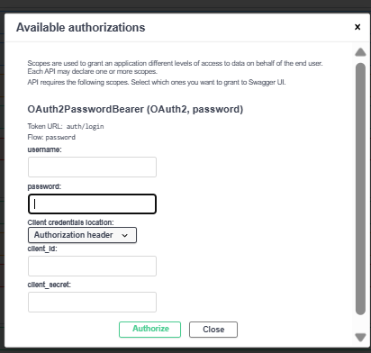

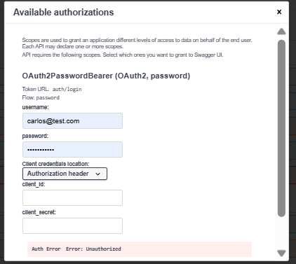

---

## Explicación de CORS configurado

La API tiene configurado CORS mediante el middleware `CORSMiddleware` de FastAPI.

Se permiten solicitudes desde los siguientes orígenes:

```python
allow_origins = [
    "http://localhost:5173",
    "http://localhost:3000"
]


## Reflexión final sobre la importancia de la seguridad en APIs REST

La seguridad en las APIs REST es un aspecto fundamental para proteger la información y garantizar que únicamente los usuarios autorizados puedan acceder a los recursos del sistema. Durante el desarrollo de este proyecto se implementaron diferentes mecanismos de seguridad, como autenticación mediante JWT, control de roles y permisos, validación de contraseñas seguras, protección de rutas, limitación de solicitudes (Rate Limiting), configuración de CORS y uso de middleware para el monitoreo de peticiones.

Estas medidas permiten reducir riesgos como accesos no autorizados, robo de información, ataques de fuerza bruta y abuso de los servicios expuestos por la API. Además, la documentación mediante Swagger/OpenAPI facilita la comprensión de los mecanismos de seguridad implementados y mejora la experiencia de los desarrolladores que consumen la API.

Como aprendizaje principal, se concluye que la seguridad no debe considerarse una característica opcional, sino un componente esencial desde las primeras etapas del desarrollo. Una API segura protege los datos, mejora la confiabilidad del sistema y brinda mayor confianza tanto a los usuarios como a las organizaciones que utilizan la aplicación.