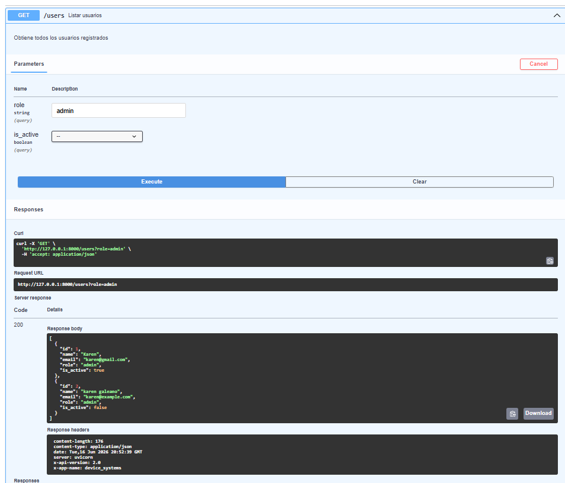
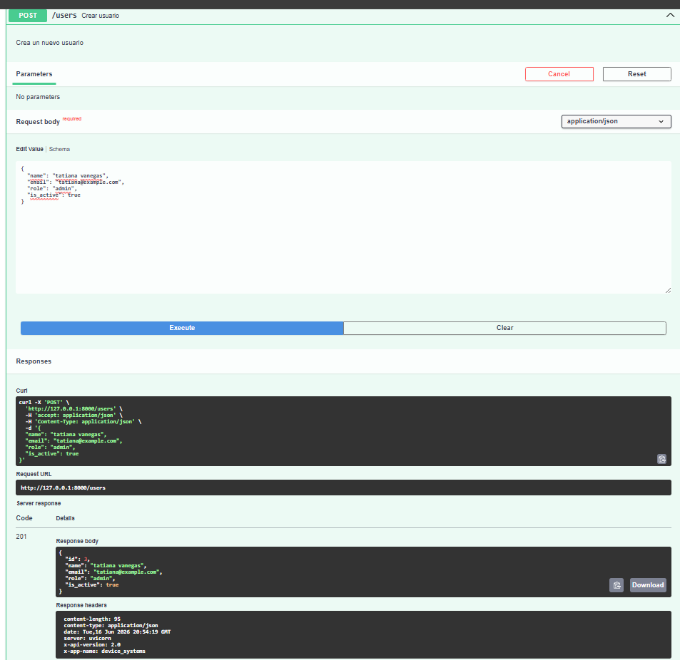
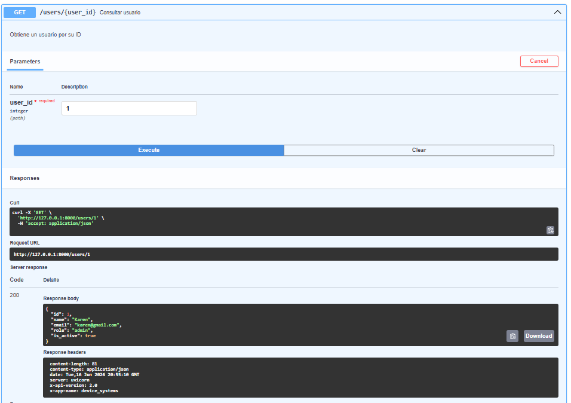
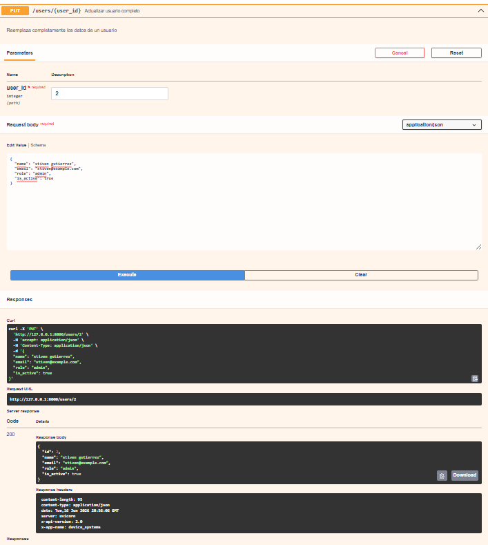
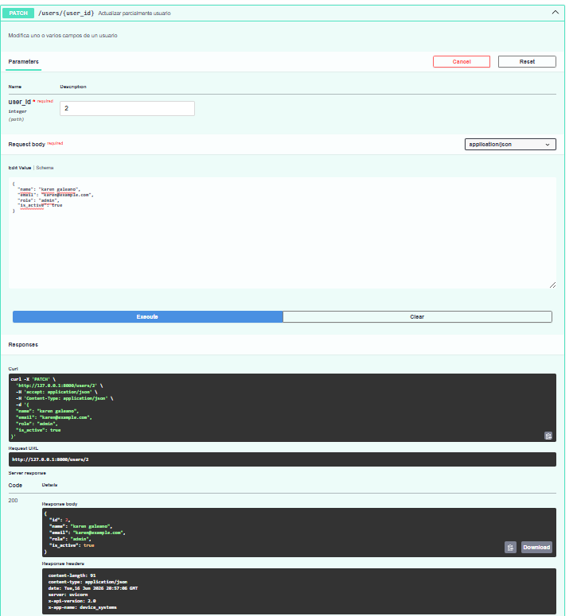
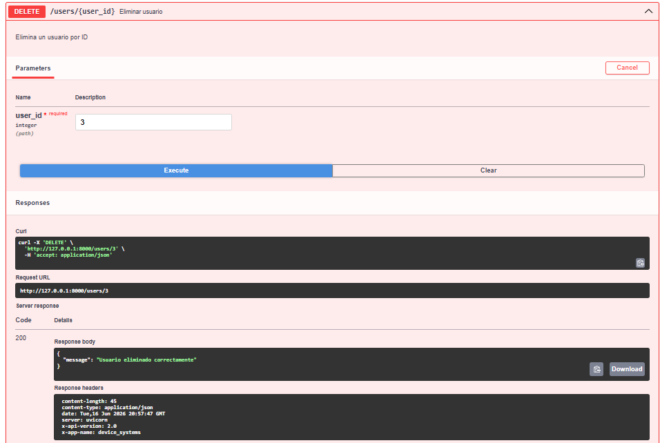
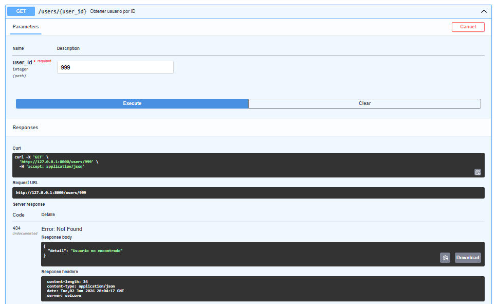
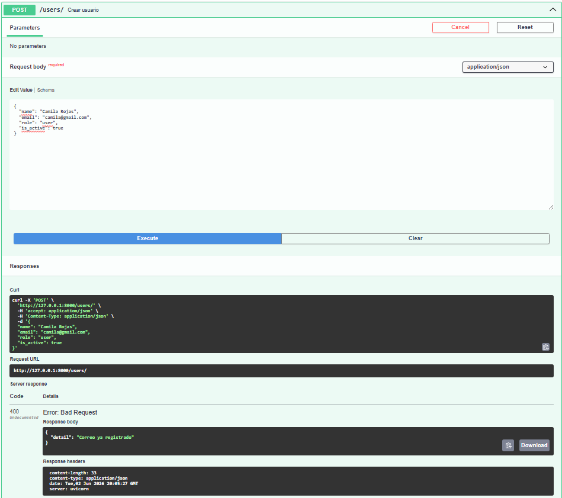

# device_systems crud completo

## Descripción

**device_systems** es una API REST desarrollada con FastAPI para la gestión de usuarios. El proyecto implementa operaciones CRUD completas sobre el recurso **users**, permitiendo crear, consultar, actualizar y eliminar usuarios.

Además, la aplicación incorpora validación de datos mediante Pydantic, manejo de errores con HTTPException, documentación automática con Swagger UI y ReDoc, y reutilización de lógica mediante Dependency Injection.

---

# Tecnologías utilizadas

- Python 3
- FastAPI
- Uvicorn
- Pydantic v2
- Git
- GitHub

---

# Instalación

Instalar las dependencias necesarias:

```bash
pip install fastapi
pip install uvicorn
pip install pydantic
pip install email-validator
```

O utilizando requirements.txt:

```bash
pip install -r requirements.txt
```

---

# Ejecución del proyecto

Ejecutar el servidor desde la raíz del proyecto:

```bash
python -m uvicorn app.main:app --reload
```

La API estará disponible en:

```text
http://127.0.0.1:8000
```
---

# Estructura del proyecto

```text
device_systems/
│
├── app/
│   ├── main.py
│   │
│   ├── routes/
│   │   └── user_routes.py
│   │
│   ├── schemas/
│   │   └── user_schema.py
│   │
│   ├── services/
│   │   └── user_service.py
│   │
│   ├── dependencies/
│   │   └── user_dependencies.py
│   │
│   └── data/
│       └── users_db.py
│
├── images/
│
├── requirements.txt
└── README.md
```

---

# Explicación de la estructura

### routes

Contiene los endpoints de la API.

### schemas

Contiene los modelos Pydantic utilizados para validar datos de entrada y salida.

### services

Contiene la lógica de negocio relacionada con los usuarios.

### dependencies

Contiene funciones reutilizables mediante Dependency Injection.

### data

Contiene la simulación de la base de datos en memoria.

---

# Endpoints disponibles

| Método | Endpoint | Descripción |
|----------|-------------|-------------|
| GET | /users | Listar usuarios |
| GET | /users/{user_id} | Consultar usuario por ID |
| POST | /users | Crear usuario |
| PUT | /users/{user_id} | Actualizar usuario completamente |
| PATCH | /users/{user_id} | Actualizar parcialmente un usuario |
| DELETE | /users/{user_id} | Eliminar usuario |

---

# Evidencia de pruebas de endpoints

## Captura 1 - GET /users



---

## Captura 2 - GET /users/{user_id}



---

## Captura 3 - POST /users



---

## Captura 4 - PUT /users/{user_id}



---

## Captura 5 - PATCH /users/{user_id}



---

## Captura 6 - DELETE /users/{user_id}



---

# Evidencia de errores controlados

## Captura 7 - Error 404 Not Found

Prueba realizada consultando un usuario inexistente.

**Respuesta obtenida:**

```json
{
  "detail": "Usuario no encontrado"
}
```



---

## Captura 8 - Error 400 Bad Request

Prueba realizada intentando registrar un correo electrónico duplicado.

**Respuesta obtenida:**

```json
{
  "detail": "El correo ya existe"
}
```



---

# Ejemplo de creación de usuario

```json
{
  "name": "Karen",
  "email": "karen@gmail.com",
  "role": "admin",
  "is_active": true
}
```

---

# Dependency Injection (Depends)

Se implementó Dependency Injection mediante la función:

```python
def get_user_or_404(user_id: int):
```

Esta dependencia permite validar la existencia de un usuario antes de realizar operaciones como actualización o eliminación.

### Beneficios

- Reutilización de código.
- Menor duplicación de lógica.
- Mejor organización del proyecto.
- Mayor mantenibilidad.

---

# Manejo de errores

La API controla diferentes situaciones mediante HTTPException:

- Usuario no encontrado.
- Correo electrónico duplicado.
- Actualización sin datos.
- Eliminación de usuario inexistente.
- Errores de validación de Pydantic.

Ejemplo:

```json
{
  "detail": "Usuario no encontrado"
}
```

---

# Códigos de estado HTTP utilizados

| Código | Descripción |
|----------|-------------|
| 200 | Operación exitosa |
| 201 | Recurso creado correctamente |
| 400 | Solicitud incorrecta |
| 404 | Usuario no encontrado |
| 422 | Error de validación |

---

# Reflexión final

Durante el desarrollo de esta actividad se evolucionó una API básica hacia una API REST más completa y profesional. Se implementaron operaciones CRUD completas utilizando los métodos GET, POST, PUT, PATCH y DELETE. También se incorporaron validaciones mediante Pydantic, manejo de errores con HTTPException y documentación automática mediante Swagger UI y ReDoc.

La utilización de Dependency Injection permitió reutilizar lógica común y mejorar la organización del proyecto. Esta evolución facilitó la comprensión de buenas prácticas para el desarrollo de APIs REST utilizando FastAPI.