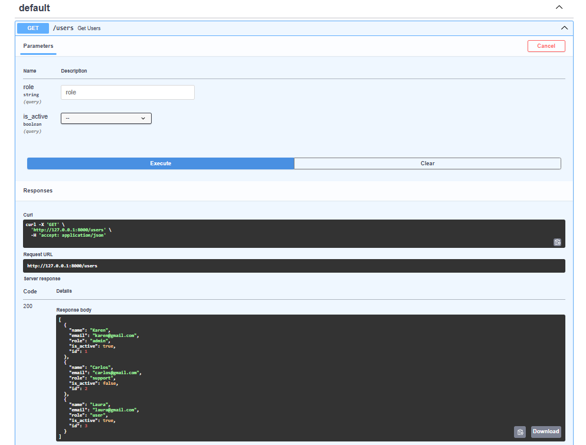
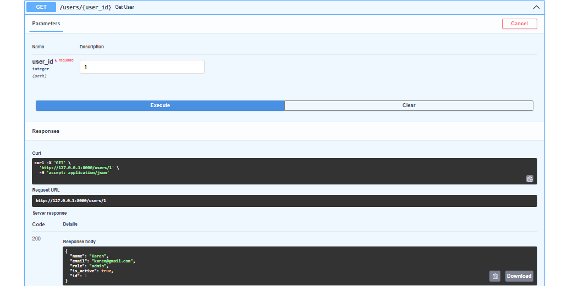
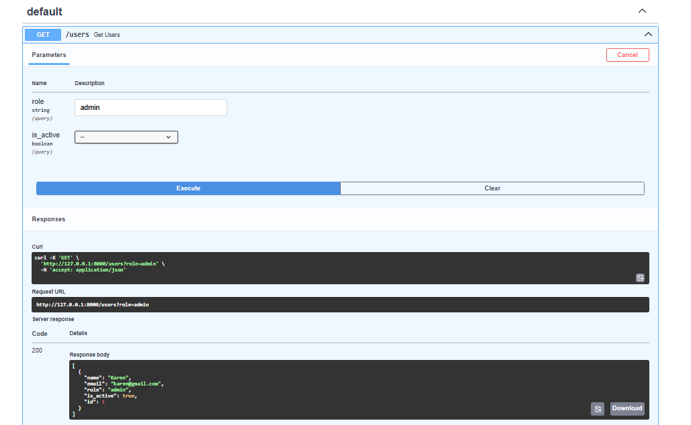
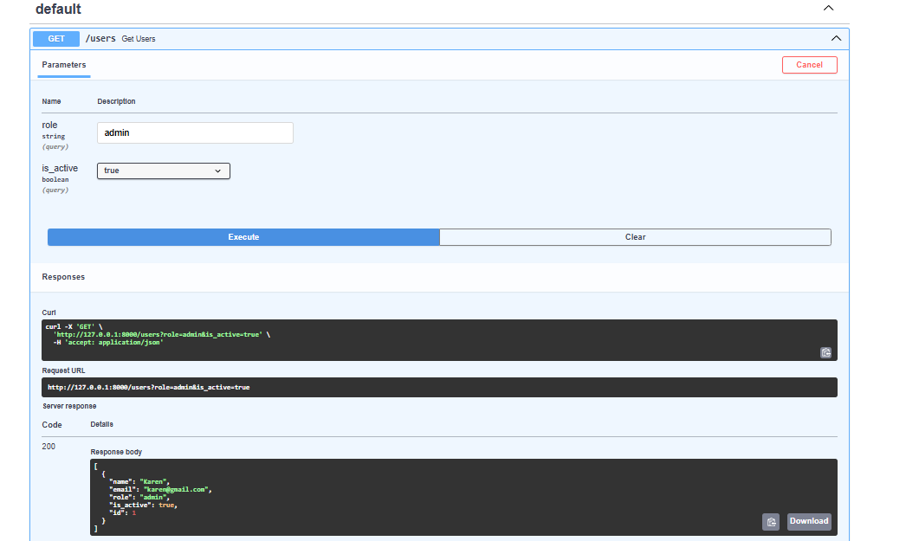
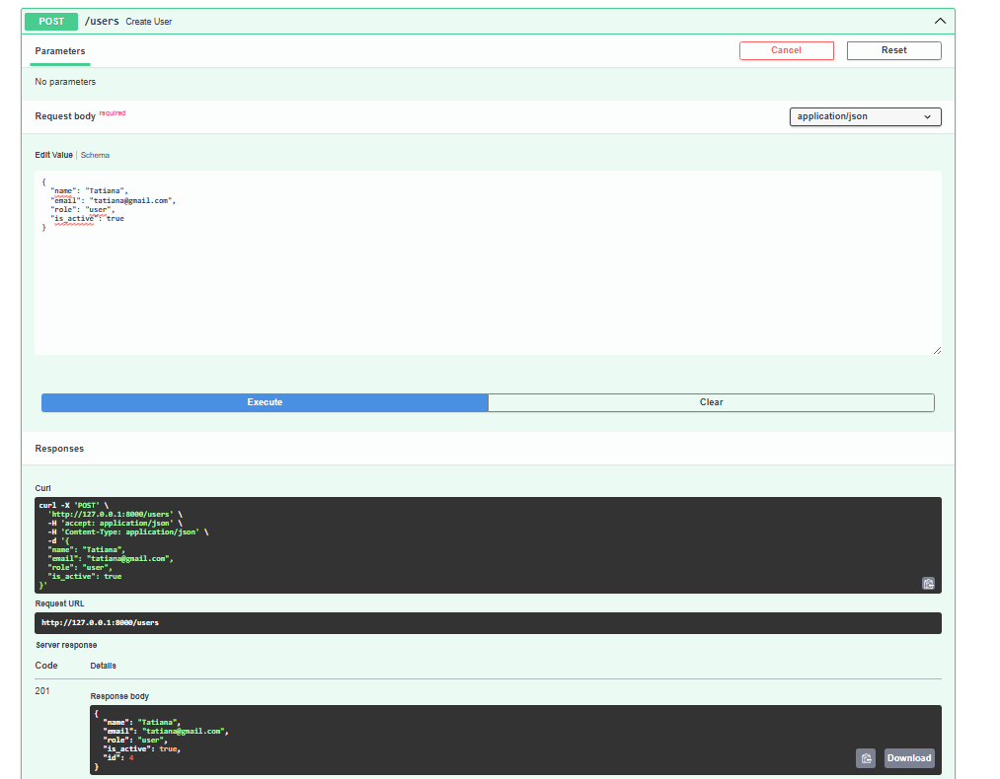
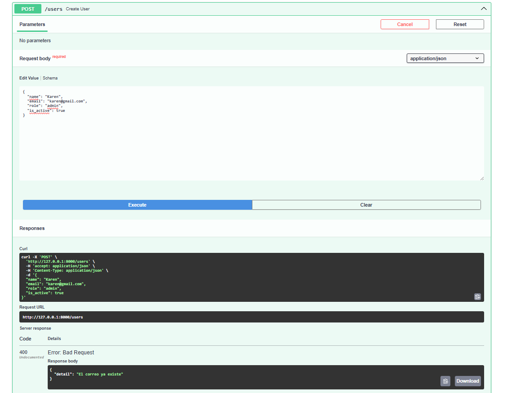

# 📱 device_systems API

##  Descripción

`device_systems` es una API desarrollada con FastAPI para la gestión de dispositivos y usuarios.  
La aplicación permite registrar, consultar y administrar información mediante endpoints RESTful.

Este proyecto fue desarrollado utilizando Python y FastAPI, implementando buenas prácticas de desarrollo backend y documentación automática con Swagger UI.

---

#  Tecnologías Utilizadas

- Python 3
- FastAPI
- Uvicorn
- Pydantic
- Swagger UI

---

#  Instalación de Dependencias

## 1. Clonar el repositorio

```bash
git clone https://github.com/tu_usuario/device_systems.git
```

---

## 2. Ingresar al proyecto

```bash
cd device_systems
```

---

## 3. Crear entorno virtual

### Windows

```bash
python -m venv venv
```

---

## 4. Activar entorno virtual

### Windows

```bash
venv\Scripts\activate
```

---

## 5. Instalar dependencias

```bash
pip install -r requirements.txt
```

---

#  Ejecución del Servidor

Ejecutar el servidor con el siguiente comando:

```bash
python -m uvicorn app.main:app --reload
```

Servidor disponible en:

```txt
http://127.0.0.1:8000
```

---

#  Documentación Swagger UI

FastAPI genera documentación automática.

Acceder desde:

```txt
http://127.0.0.1:8000/docs
```

---

#  Tabla de Endpoints

| Método | Endpoint | Descripción |
|---|---|---|
| GET | / | Mensaje de bienvenida |
| GET | /users | Obtener lista de usuarios |
| POST | /users | Crear nuevo usuario |
| GET | /devices | Obtener lista de dispositivos |
| POST | /devices | Registrar dispositivo |

---

#  Ejemplo de Petición GET

## Obtener usuarios

### Request

```http
GET /users
```

### Response

```json
[
  {
    "id": 1,
    "name": "Karen",
    "email": "karen@gmail.com"
  }
]
```

---

#  Ejemplo de Petición POST

## Crear usuario

### Request

```http
POST /users
```

### Body

```json
{
  "name": "Karen",
  "email": "karen@gmail.com"
}
```

### Response

```json
{
  "message": "Usuario creado correctamente"
}
```

---

#  Capturas de Swagger UI

##  Ejemplo 1



---

##  Ejemplo 2



---

## Ejemplo 3



---

##  Ejemplo 4



---

##  Ejemplo 5



---

##  Ejemplo 6



---

# Estructura del Proyecto

```txt
device_systems/
│
├── app/
│   ├── main.py
│   ├── routers/
│   ├── models/
│   └── schemas/
│
├── images/
│   ├── ejemplo1.png
│   ├── ejemplo2.png
│   ├── ejemplo3.png
│   ├── ejemplo4.png
│   ├── ejemplo5.png
│   └── ejemplo6.png
│
├── requirements.txt
├── README.md
```